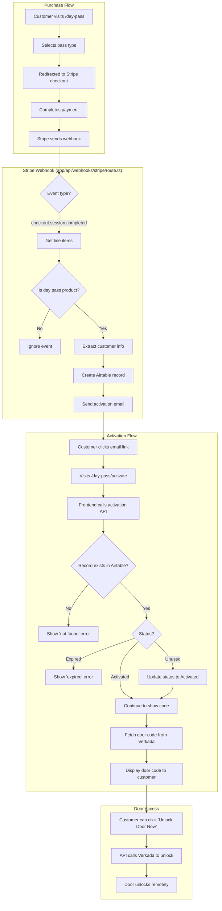

# Day Pass Purchase & Activation Flow

This document describes the flow for purchasing and activating day passes.

## Flowchart



## Product IDs

| Product | Stripe Product ID | Price |
|---------|------------------|-------|
| Day Pass | `prod_T5NXc8MwPn1ZIl` | $70 |
| Happy Hour Pass | `prod_T5NXlD25uP8tnI` | $40 |
| Week Pass | `prod_SqejoSJqKlR4A5` | TBD |

## Key Components

| Component | File | Purpose |
|-----------|------|---------|
| Purchase Page | `app/day-pass/page.tsx` | Display pass options with Stripe payment links |
| Stripe Webhook | `app/api/webhooks/stripe/route.ts` | Handle payment completion, create Airtable record, send email |
| Activation Page | `app/day-pass/activate/page.tsx` | Display door code after activation |
| Activation API | `app/day-pass/activate/api/route.ts` | Validate pass, fetch Verkada door code |
| Door Unlock API | `app/day-pass/activate/unlock-api/route.ts` | Remote door unlock via Verkada |

## Airtable Schema (Day Passes table)

| Field | Type | Description |
|-------|------|-------------|
| Name | Text | Stripe payment intent ID (used as unique identifier) |
| Username | Text | Customer name from Stripe |
| Email | Email | Customer email |
| Pass Type | Single Select | Day Pass, Happy Hour Pass, or Week Pass |
| Status | Single Select | Unused, Activated, or Expired |
| Date Purchased | Date | When payment was made |
| Date Activated | Date | When customer first accessed the code |

## Environment Variables Required

```bash
# Stripe
STRIPE_SECRET_KEY=sk_live_...
STRIPE_WEBHOOK_SECRET=whsec_...

# Airtable
AIRTABLE_BASE_ID=appXXXXXX
AIRTABLE_API_KEY=patXXXXXX        # Read access
AIRTABLE_WRITE_KEY=patXXXXXX      # Write access

# Verkada (door access)
VERKADA_UUID=...                   # Day pass user UUID
VERKADA_MEMBER_KEY=...             # API key for user lookup
VERKADA_API_KEY=...                # API key for door unlock

# Email
RESEND_API_KEY=re_...

# App
NEXT_PUBLIC_BASE_URL=https://moxsf.com
```

## Stripe Webhook Setup

1. Go to [Stripe Dashboard → Webhooks](https://dashboard.stripe.com/webhooks)
2. Click "Add endpoint"
3. Enter endpoint URL: `https://moxsf.com/api/webhooks/stripe`
4. Select events to listen to: `checkout.session.completed`
5. Copy the signing secret and add it as `STRIPE_WEBHOOK_SECRET` env var

### Testing Locally

Use Stripe CLI to forward webhooks to localhost:

```bash
stripe listen --forward-to localhost:3000/api/webhooks/stripe
```

This will output a webhook signing secret for local testing.

## Email Notifications

When a day pass is purchased, the customer receives an email with:
- Pass type and description
- Activation link
- Address and entry instructions

## Error Handling

- **Invalid signature**: Webhook rejected (Stripe will retry)
- **Missing customer email**: Logged but not retried
- **Airtable creation fails**: Logged, email not sent
- **Email send fails**: Logged but record still created
