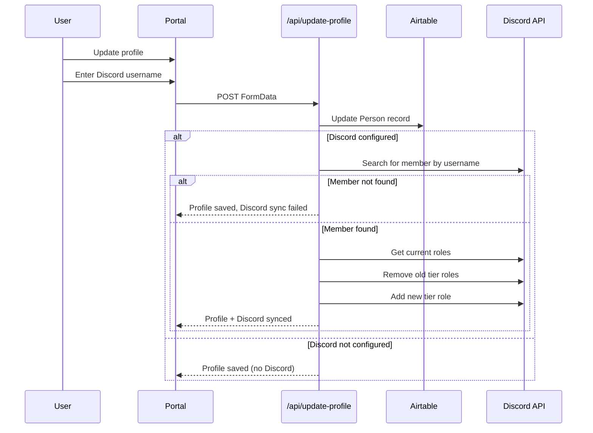
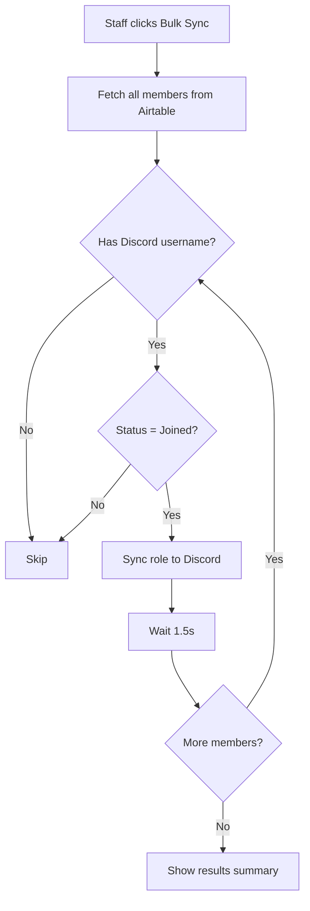
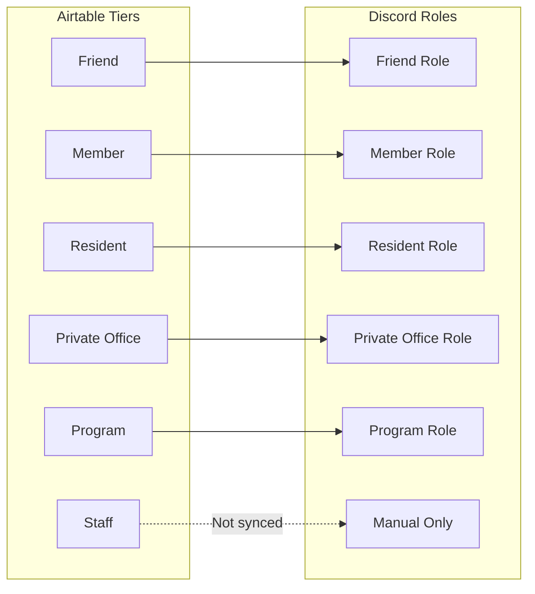
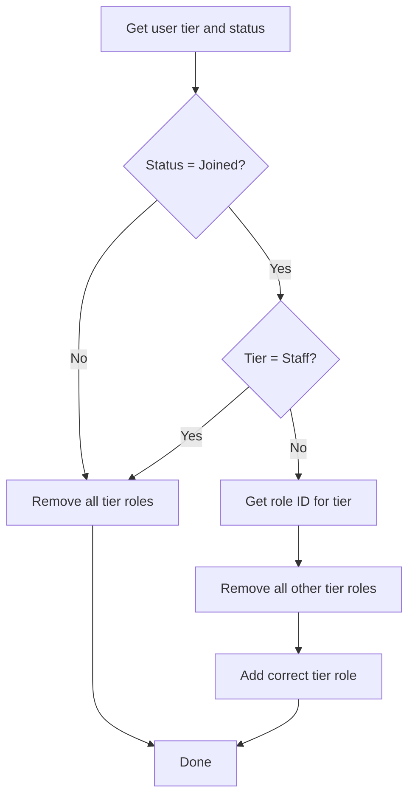
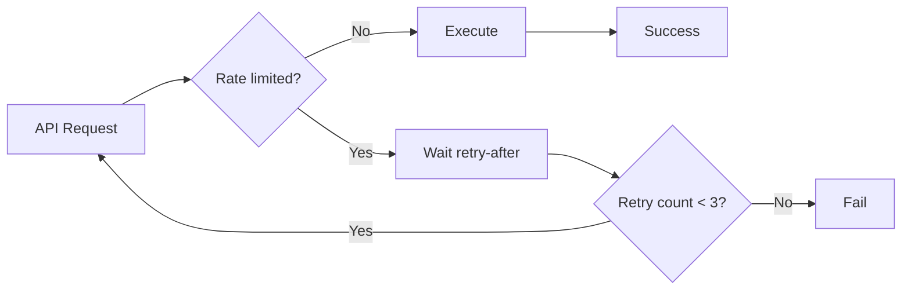

# Discord Role Sync

Synchronization of membership tiers to Discord roles.

## Auto-Sync on Profile Update



## Bulk Sync (Staff Only)



## Role Mapping



## Sync Logic



## Discord Mapping Tool

Interactive tool for staff to match Discord members to Airtable records.

```mermaid
flowchart TB
    subgraph Input
        A[Paste Discord member list]
    end

    subgraph Parse
        B[Parse various formats]
        B1[username]
        B2[DisplayName - username]
        B3[Nick | Display | user]
    end

    subgraph Match
        C[Fuzzy match to Airtable]
        C1[Levenshtein distance]
        C2[Compare names, emails]
        C3[70% confidence threshold]
    end

    subgraph Review
        D[Show matches for review]
        D1[Auto-confirmed matches]
        D2[Needs review]
        D3[No match found]
    end

    subgraph Save
        E[Batch update Airtable]
        E1[50 per batch]
    end

    A --> B
    B --> B1 & B2 & B3
    B1 & B2 & B3 --> C
    C --> C1 --> C2 --> C3
    C3 --> D
    D --> D1 & D2 & D3
    D1 & D2 --> E
    E --> E1
```

## Rate Limiting



## Error Handling

| Error | Cause | Resolution |
|-------|-------|------------|
| 403 Forbidden | Bot role too low | Move bot role above tier roles |
| 404 Not Found | User left server | Skip user, mark as "not found" |
| 429 Rate Limited | Too many requests | Auto-retry with delay |

## Key Files

- Discord client: [app/lib/discord.ts](../../app/lib/discord.ts)
- Profile update: [app/portal/api/update-profile/route.ts](../../app/portal/api/update-profile/route.ts)
- Sync single: [app/portal/api/sync-discord-role/route.ts](../../app/portal/api/sync-discord-role/route.ts)
- Bulk sync: [app/portal/api/bulk-sync-discord-roles/route.ts](../../app/portal/api/bulk-sync-discord-roles/route.ts)
- Mapping tool: [app/portal/admin/discord-mapping/](../../app/portal/admin/discord-mapping/)
