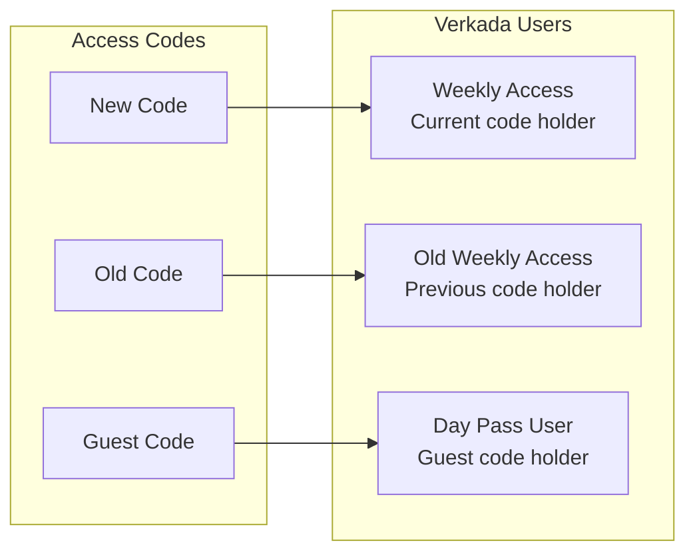
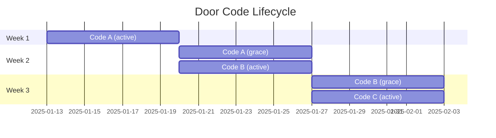

# Weekly Door Code Rotation

Automated weekly rotation of guest door access codes.

## Overview

```mermaid
flowchart TB
    subgraph Trigger["⏰ Vercel Cron"]
        A[Monday 5PM UTC]
    end

    subgraph Auth["🔐 Authentication"]
        B{Valid CRON_SECRET?}
    end

    subgraph Verkada["🚪 Verkada"]
        C[Get current code from Weekly Access user]
        D[Generate new 4-digit code]
        E[Move old code to Old Weekly Access user]
        F[Set new code on Weekly Access user]
    end

    subgraph Discord["💬 Discord"]
        G[Rename door code channel]
        H[Post to #packages channel]
    end

    A --> B
    B -->|No| X[401 Unauthorized]
    B -->|Yes| C
    C --> D
    D --> E
    E --> F
    F --> G
    G --> H
    H --> Z[✅ Success response]
```



## Detailed Flow

```mermaid
sequenceDiagram
    participant V as Vercel Cron
    participant API as /api/cron/rotate-door-code
    participant VK as Verkada API
    participant D as Discord API

    V->>API: GET (with Bearer token)
    API->>API: Validate CRON_SECRET

    API->>VK: Get auth token
    VK-->>API: Token

    API->>VK: Get Weekly Access user credentials
    VK-->>API: Current code (e.g., "5678")

    API->>API: Generate new code (crypto-secure)
    Note right of API: e.g., "1234"

    API->>VK: Update Old Weekly Access user
    Note right of VK: Set code to "5678"

    API->>VK: Update Weekly Access user
    Note right of VK: Set code to "1234"

    API->>D: PATCH channel name
    Note right of D: "🚪 Code: 1234#"

    API->>D: POST message to #packages
    Note right of D: "🔄 Door code rotated!<br/>Old code 5678# works until {date}"

    API-->>V: 200 OK + summary
```



## Verkada User Setup



## Code Validity Timeline



## Discord Updates

### Channel Rename
```
Before: 🚪 Code: 5678#
After:  🚪 Code: 1234#
```

### Notification Message
> 🔄 **Door code rotated!**
>
> The old code **5678#** will continue to work until Monday, January 27.

## Environment Variables

| Variable | Description |
|----------|-------------|
| `CRON_SECRET` | Bearer token for cron auth |
| `VERKADA_API_KEY` | Verkada API key |
| `VERKADA_MEMBER_KEY` | Token generation key |
| `VERKADA_WEEKLY_ACCESS_USER_ID` | Current code user UUID |
| `VERKADA_OLD_WEEKLY_ACCESS_USER_ID` | Old code user UUID |
| `DISCORD_DOOR_CODE_CHANNEL_ID` | Channel to rename |
| `DISCORD_PACKAGES_CHANNEL_ID` | Channel for notifications |

## Cron Configuration

In `vercel.json`:
```json
{
  "crons": [{
    "path": "/api/cron/rotate-door-code",
    "schedule": "0 17 * * 1"
  }]
}
```

Schedule: Every Monday at 5:00 PM UTC (9:00 AM PST / 10:00 AM PDT)

## Key Files

- Cron endpoint: [app/api/cron/rotate-door-code/route.ts](../../app/api/cron/rotate-door-code/route.ts)
- Discord utils: [app/lib/discord.ts](../../app/lib/discord.ts)
