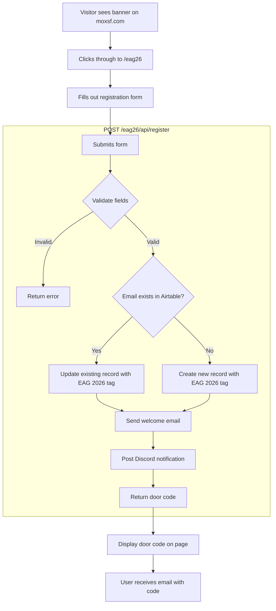

# EAG Day Pass Flow (Free Registration)

This document describes the free day pass registration flow for EAG SF 2026 attendees.

> **Note:** For the standard paid day pass flow, see [day-pass-flow.md](./day-pass-flow.md).

## Overview

During EAG SF 2026 (Feb 9-17, 2026), attendees and their guests can get free day passes without payment. This is a simplified flow compared to the standard Stripe checkout.

## Flowchart

## Form Fields

| Field | Required | Validation |
|-------|----------|------------|
| Name | Yes | Non-empty |
| Email | Yes | Valid email format |
| Website/LinkedIn | Yes | Valid URL |
| EAG Attendee Checkbox | Yes | Must be checked |

## Key Components

| Component | File | Purpose |
|-----------|------|---------|
| Banner | `app/components/EAGBanner.tsx` | Homepage banner linking to /eag26, hidden after Feb 17 |
| Registration Page | `app/eag26/page.tsx` | Form to collect visitor info |
| Registration API | `app/eag26/api/register/route.ts` | Process registration, store in Airtable, send notifications |
| Welcome Email | `app/lib/emails/eag-welcome.md` | Email template with door code |
| Email Sender | `app/lib/emails/eag-welcome.ts` | Sends email via Resend |

## Airtable Integration

Unlike paid day passes (which use the Day Passes table), EAG registrations go into the **People** table:

| Field | Value |
|-------|-------|
| Name | From form |
| Email | From form |
| Website | From form |
| Tags | `["EAG 2026"]` (appended to existing tags if record exists) |

This allows tracking EAG visitors as potential future members.

## Environment Variables

| Variable | Purpose |
|----------|---------|
| `EAG_GUEST_CODE` | The door code shown to registrants |
| `RESEND_API_KEY` | For sending welcome emails |
| `DISCORD_BOT_TOKEN` | For posting registration notifications |

## Door Code Access

- **Code:** Set via `EAG_GUEST_CODE` environment variable
- **Valid hours:** 9 AM – 8 PM daily
- **Valid dates:** Through Feb 17, 2026
- **Access level:** Front door only (no Verkada PIN integration)

## Differences from Standard Day Pass

| Aspect | Standard Day Pass | EAG Day Pass |
|--------|-------------------|--------------|
| Payment | Stripe checkout ($70) | Free |
| Storage | Day Passes table | People table with tag |
| Door code | Verkada API lookup | Static env variable |
| Activation | Separate step required | Immediate on form submit |
| Duration | Single day | All of EAG week |

## Banner Behavior

The `EAGBanner` component:
- Shows on homepage only (not on /eag26 itself)
- Auto-hides after Feb 17, 2026 (PT)
- Shows different text for logged-in vs logged-out users
- Uses `data-top-banner` attribute so `PortalNav` positions below it
