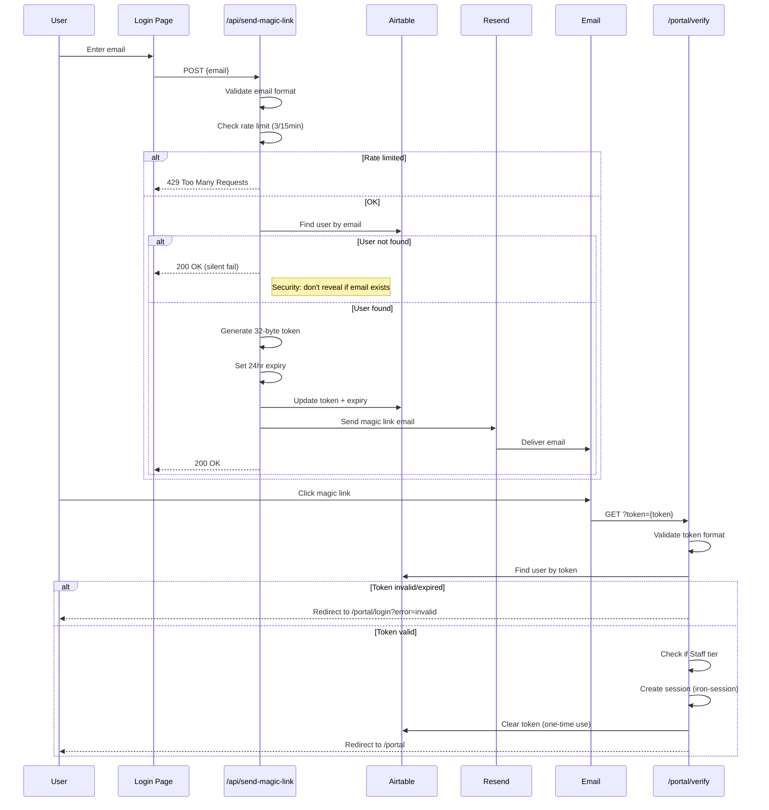
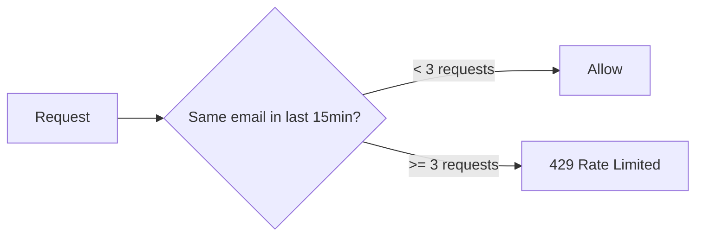
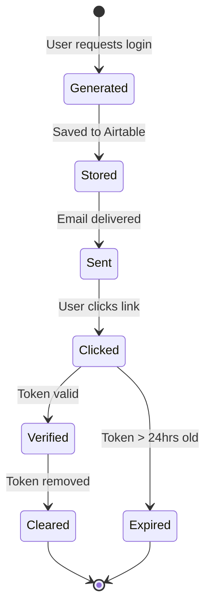

# Magic Link Authentication

Email-based passwordless login flow.

## Flow Diagram

## Rate Limiting

## Token Lifecycle

## Security Features

- 32-byte cryptographically random token (64 hex chars)
- 24-hour expiration
- One-time use (cleared after verification)
- Silent failure for unknown emails
- Rate limiting per email address

## Key Files

- Login page: [app/portal/login/page.tsx](../../app/portal/login/page.tsx)
- Send link: [app/portal/api/send-magic-link/route.ts](../../app/portal/api/send-magic-link/route.ts)
- Verify: [app/portal/verify/route.ts](../../app/portal/verify/route.ts)
