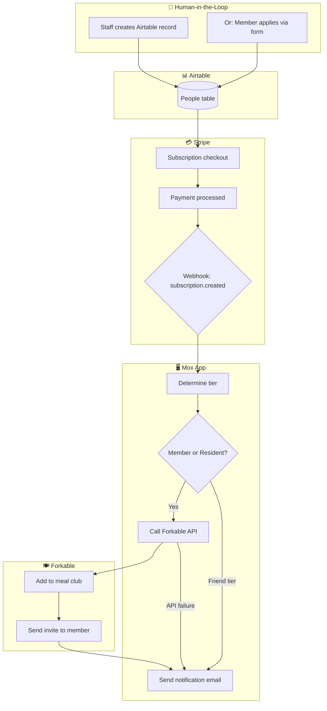

# Member Onboarding Workflow

This documents the complete flow from new member signup through active subscription.

## Overview

## Tier to Forkable Club Mapping

### Via Stripe (subscription purchase)

| Stripe Product | Airtable Tier | Forkable Club |
|----------------|---------------|---------------|
| prod_RpkYg9EMJoi5oi | Member | MOX_MEMBERS |
| prod_RpkufjD9E3esG5 | Resident | MOX_RESIDENTS |
| prod_Rq9VzfM9QoJwPD | Friend | None |

### Via Airtable Automation (non-Stripe members)

| Airtable Tier | Forkable Club |
|---------------|---------------|
| Private Office | MOX_RESIDENTS |
| Program | MOX_MEMBERS |

See [forkable-tier-sync.md](./forkable-tier-sync.md) for Airtable automation setup.

Stripe product IDs and Forkable club IDs are configured in the webhook handler and forkable.ts.

## Notification Emails

**To: team@moxsf.com**

Success:
> Subject: Forkable: {name} added successfully
>
> {name} ({email}) has been added to {clubName}.
> They will receive an invitation from Forkable.

Failure:
> Subject: Forkable: Failed to add {name}
>
> Error adding {name} ({email}) to Forkable: {error}
> Please add them manually.

## Key Files

- Webhook handler: [app/api/webhooks/stripe/route.ts](../../app/api/webhooks/stripe/route.ts)
- Forkable client: [app/lib/forkable.ts](../../app/lib/forkable.ts)
