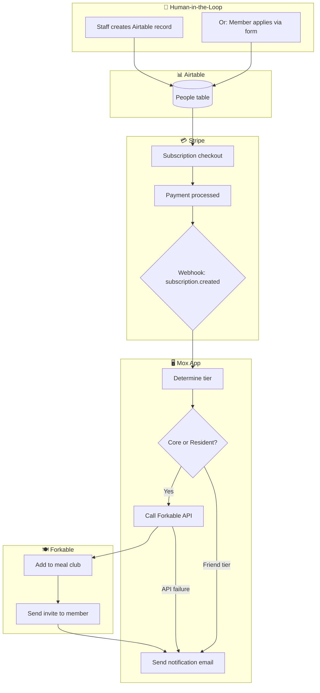

# Member Onboarding Workflow

This documents the complete flow from new member signup through active subscription.

## Overview

```mermaid
flowchart TB
    subgraph Manual["👤 Human-in-the-Loop"]
        A1[Staff creates Airtable record]
        A2[Or: Member applies via form]
    end

    subgraph Airtable["📊 Airtable"]
        B1[(People table)]
    end

    subgraph Stripe["💳 Stripe"]
        C1[Subscription checkout]
        C2[Payment processed]
        C3{Webhook: subscription.created}
    end

    subgraph App["🖥️ Mox App"]
        D1[Determine tier]
        D2{Core or Resident?}
        D3[Call Forkable API]
        D4[Send notification email]
    end

    subgraph Forkable["🍽️ Forkable"]
        E1[Add to meal club]
        E2[Send invite to member]
    end

    A1 --> B1
    A2 --> B1
    B1 --> C1
    C1 --> C2
    C2 --> C3
    C3 --> D1
    D1 --> D2
    D2 -->|Yes| D3
    D2 -->|Friend tier| D4
    D3 --> E1
    E1 --> E2
    E2 --> D4
    D3 -->|API failure| D4
```

## Pricing and Checkout

Membership prices live in `app/lib/membership-pricing.ts` and are rendered by
`app/components/MembershipPricingTable.tsx` on `/join` (invited visitors) and
`/portal/renew` (lapsed members). Each tier has a quarterly rate (billed every
3 months up front) and a month-to-month rate; the table toggles between them.

Clicking a tier calls `POST /api/membership-checkout`, which finds the Stripe
Price by `lookup_key` and opens Stripe Checkout with a 7-day trial. The lookup
keys must exist on active Prices under the existing membership Products so the
webhook's product → tier mapping below keeps working:

| Lookup key | Product | Amount |
|------------|---------|--------|
| `membership_core_quarterly` | prod_RpkYg9EMJoi5oi (Core) | $1,350 every 3 months |
| `membership_core_monthly` | prod_RpkYg9EMJoi5oi (Core) | $595 monthly |
| `membership_resident_quarterly` | prod_RpkufjD9E3esG5 (Resident) | $2,550 every 3 months |
| `membership_resident_monthly` | prod_RpkufjD9E3esG5 (Resident) | $995 monthly |

To change a price: create the new Price in Stripe, move the lookup key to it,
and update the amount in `membership-pricing.ts` so the table matches. The
checkout route logs a warning if the two ever disagree.

Private offices are quoted by hand (the Office column links to email).

## Tier to Forkable Club Mapping

### Via Stripe (subscription purchase)

| Stripe Product | Airtable Tier | Forkable Club |
|----------------|---------------|---------------|
| prod_RpkYg9EMJoi5oi | Core | MOX_MEMBERS |
| prod_RpkufjD9E3esG5 | Resident | MOX_RESIDENTS |
| prod_Rq9VzfM9QoJwPD | Friend | None |

### Via Airtable Automation (non-Stripe members)

| Airtable Tier | Forkable Club |
|---------------|---------------|
| Private Office | MOX_RESIDENTS |
| Program | MOX_MEMBERS |

See [forkable-tier-sync.md](./forkable-tier-sync.md) for Airtable automation setup.

Stripe product IDs and Forkable club IDs are configured in the webhook handler and forkable.ts.

## Notification Emails

**To: team@moxsf.com**

Success:
> Subject: Forkable: {name} added successfully
>
> {name} ({email}) has been added to {clubName}.
> They will receive an invitation from Forkable.

Failure:
> Subject: Forkable: Failed to add {name}
>
> Error adding {name} ({email}) to Forkable: {error}
> Please add them manually.

## Key Files

- Webhook handler: [app/api/webhooks/stripe/route.ts](../../app/api/webhooks/stripe/route.ts)
- Forkable client: [app/lib/forkable.ts](../../app/lib/forkable.ts)
