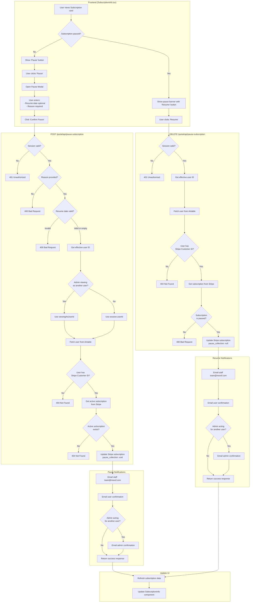

# Subscription Pause/Resume Flow

This document describes the flow for pausing and resuming member subscriptions.

## Flowchart

## Key Components

| Component | File | Purpose |
|-----------|------|---------|
| Frontend UI | `app/portal/SubscriptionInfo.tsx` | Pause modal, resume button, status display |
| API Route | `app/portal/api/pause-subscription/route.ts` | POST (pause) and DELETE (resume) handlers |

## Pause Options

1. **With resume date**: Stripe auto-resumes billing on specified date
2. **Indefinite**: No `resumes_at` set; user must manually resume

## Email Notifications

| Event | Recipients |
|-------|------------|
| Pause | Staff (team@moxsf.com), User, Admin (if acting for another user) |
| Resume | Staff (team@moxsf.com), User, Admin (if acting for another user) |

## Stripe Integration

- Uses `pause_collection.behavior: 'void'` - doesn't collect payment, adjusts billing cycle
- Pause reason stored in subscription metadata
- Resume clears `pause_collection` to `null`

## Admin "View As" Feature

When staff members use the "view as" feature to manage another user's subscription:
- The `viewingAsUserId` session field identifies the target user
- Both the target user AND the admin receive email notifications
- This provides an audit trail for admin actions
