# System Overview

High-level view of all integrations and data flows.

## Architecture

```mermaid
flowchart TB
    subgraph Users["👥 Users"]
        M[Members]
        G[Guests]
        S[Staff]
    end

    subgraph App["🖥️ Mox App (Next.js)"]
        Portal[Member Portal]
        DayPass[Day Pass Pages]
        API[API Routes]
        Cron[Cron Jobs]
    end

    subgraph External["🔌 External Services"]
        AT[(Airtable)]
        ST[Stripe]
        VK[Verkada]
        DC[Discord]
        FK[Forkable]
        RS[Resend]
    end

    M & G & S --> Portal & DayPass
    Portal & DayPass --> API
    API --> AT & ST & VK & DC & FK & RS
    Cron --> VK & DC
```

## Data Flow Summary

```mermaid
flowchart LR
    subgraph Sources["Data Sources"]
        AT[(Airtable<br/>People, Events, Orgs)]
        ST[(Stripe<br/>Subscriptions, Payments)]
    end

    subgraph App["Mox App"]
        API[API Layer]
    end

    subgraph Actions["External Actions"]
        VK[🚪 Verkada<br/>Door Access]
        DC[💬 Discord<br/>Roles & Messages]
        FK[🍽️ Forkable<br/>Meal Clubs]
        RS[📧 Resend<br/>Emails]
    end

    AT <--> API
    ST --> API
    API --> VK & DC & FK & RS
```

## Webhook & Event Flow

## Authentication Flow

## Human-in-the-Loop Processes

```mermaid
flowchart TB
    subgraph Manual["👤 Manual Steps"]
        M1[Create member record in Airtable]
        M2[Assign Staff role in Discord]
        M3[Handle Forkable failures]
        M4[Map Discord usernames]
    end

    subgraph Automated["🤖 Automated"]
        A1[Sync member Discord roles]
        A2[Create day pass records]
        A3[Send notification emails]
        A4[Rotate door codes]
    end

    M1 -->|Triggers| A1
    M4 -->|Enables| A1
    M3 -->|Fallback for| A2
```

## Suggested Airtable Automations

These workflows could benefit from Airtable automations:

```mermaid
flowchart TB
    subgraph Potential["🔮 Potential Automations"]
        P1[When Status → Cancelled<br/>Remove Discord roles]
        P2[When new Person created<br/>Send welcome email]
        P3[When Tier changes<br/>Notify staff]
        P4[When DayPass expires<br/>Update status]
    end

    subgraph Current["✅ Currently in App"]
        C1[Discord sync on profile update]
        C2[Email on subscription events]
        C3[Weekly code rotation]
    end

    P1 -.->|Could replace| C1
```

## Integration Dependencies

```mermaid
flowchart TB
    subgraph Required["🔴 Required"]
        R1[Airtable - Primary database]
        R2[Stripe - Payments]
        R3[Resend - Email delivery]
    end

    subgraph Optional["🟢 Optional"]
        O1[Discord - Role sync, notifications]
        O2[Verkada - Door access]
        O3[Forkable - Meal club onboarding]
    end

    subgraph Graceful["Graceful Degradation"]
        G1[App works without Discord]
        G2[Day passes work without Verkada]
        G3[Subscriptions work without Forkable]
    end

    O1 --> G1
    O2 --> G2
    O3 --> G3
```

## Key Workflows

| Workflow | Trigger | Key Services |
|----------|---------|--------------|
| [Member Onboarding](./member-onboarding.md) | Stripe subscription | Stripe → Forkable → Email |
| [Magic Link Auth](./magic-link-auth.md) | User login | Airtable → Email |
| [Day Pass](./day-pass-flow.md) | Stripe checkout | Stripe → Airtable → Verkada |
| [Subscription Pause](./pause-subscription-flow.md) | User action | Stripe → Email |
| [Door Code Rotation](./door-code-rotation.md) | Weekly cron | Verkada → Discord |
| [Discord Role Sync](./discord-role-sync.md) | Profile update | Airtable → Discord |
